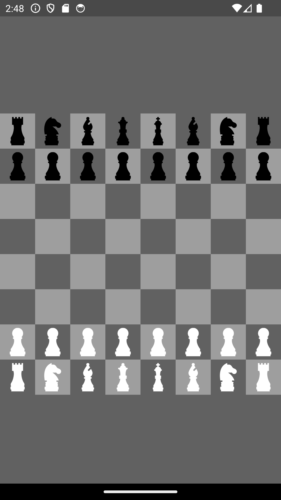
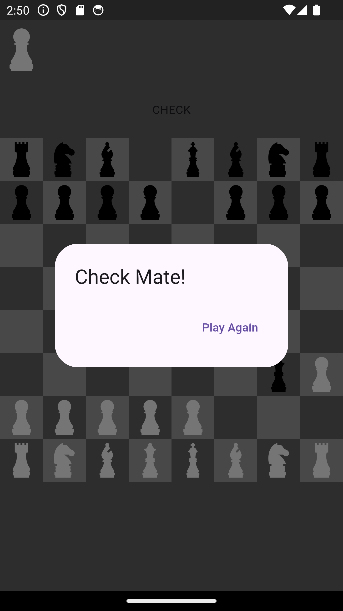

# Flutter Chess Game

This project implements a chess game in Flutter with full game logic and a responsive user interface. Players can interact with chess pieces, move them according to the rules, and see captured pieces. Features include check and checkmate detection, piece movement validation, and game reset functionality.

## Features

- **Interactive Chessboard**: Players can select and move pieces, with valid moves highlighted.
- **Turn-based Play**: Alternating turns between white and black.
- **Move Validation**: Enforces movement rules for each piece type (pawn, rook, knight, etc.).
- **Check & Checkmate Detection**: Automatically checks for check and checkmate conditions.
- **Captured Pieces**: Displays captured pieces for each player.
- **Game Reset**: Reset the game after checkmate for a new match.

## Screenshots

### Main Screen

### Checkmate Alert

## Getting Started

1. Clone the repository.
2. Install dependencies by running `flutter pub get`.
3. Run the app using `flutter run`.

## How to Play

- Tap a piece to select it.
- Valid moves will be highlighted.
- Move the piece by tapping a valid destination.
- Play alternates between white and black.
- A dialog appears when checkmate is detected, allowing you to reset the game.

